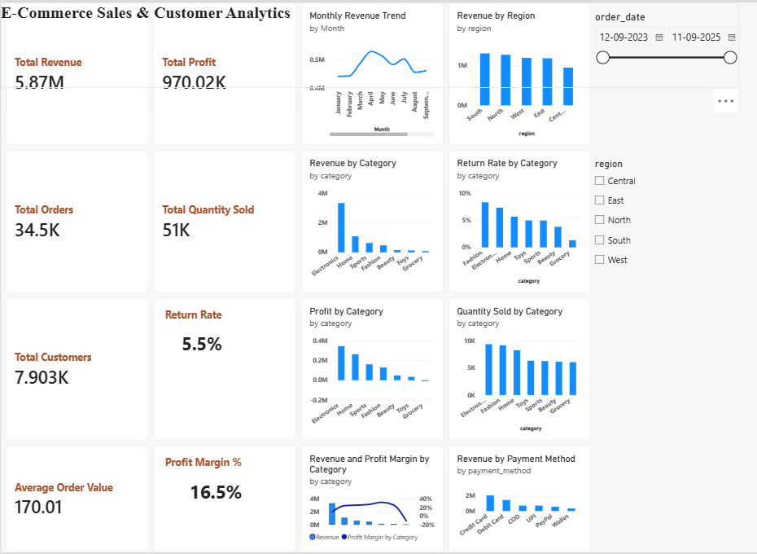

E-Commerce Sales & Customer Analytics

End-to-End E-Commerce Sales & Customer Analytics project using Python,
PostgreSQL, SQL, and Power BI.

📌 Project Overview

This project analyzes e-commerce transaction data to understand sales
performance, profitability, customer activity, product categories,
returns, regions, and payment behavior.

The project follows an end-to-end analytics workflow:

Python → PostgreSQL → SQL → Power BI → Business Insights

🎯 Business Objectives

- Evaluate overall sales and profitability
- Identify high-performing product categories
- Analyze regional revenue performance
- Understand return patterns
- Analyze payment-method contribution
- Identify monthly sales trends
- Generate actionable business recommendations

🛠️ Tools & Technologies

- Python
- Pandas
- PostgreSQL
- SQL
- Power BI
- DAX
- AI-assisted analysis

📊 Key KPIs

| KPI | Result |
|---|---:|
| Total Revenue | $5.87M |
| Total Profit | $970.02K |
| Total Orders | 34.5K |
| Total Customers | 7.903K |
| Total Quantity Sold | 51K |
| Average Order Value | $170.01 |
| Return Rate | 5.5% |
| Profit Margin | 16.5% |

📈 Power BI Dashboard

The interactive dashboard provides analysis of:

- Monthly Revenue Trend
- Revenue by Category
- Profit by Category
- Revenue & Profit Margin by Category
- Revenue by Region
- Return Rate by Category
- Quantity Sold by Category
- Revenue by Payment Method

Dashboard Preview

🔍 Key Business Insights

1. The business generated $5.87M in revenue and $970.02K in profit,
   resulting in an overall profit margin of 16.5%.

2. Electronics is the strongest revenue and profit-generating category,
   followed by Home and Sports.

3. Fashion has the highest return rate, making it an important area for
   further investigation.

4. Revenue peaks around April and shows noticeable month-to-month
   fluctuations afterward.

5. South generates the highest regional revenue, while Central has the
   lowest.

6. Credit Card generates the highest revenue among the payment methods,
   followed by Debit Card.

💡 Business Recommendations

- Prioritize inventory and promotional planning for high-performing
  categories such as Electronics and Home.
- Investigate the reasons behind the higher return rate in Fashion.
- Compare product mix, demand, and promotional activity between
  high- and low-performing regions.
- Use historical monthly patterns to improve sales and inventory planning.
- Continue supporting high-performing payment methods while monitoring
  lower-performing options.

🤖 AI-Assisted Analytics

AI was used as an analytical assistant to help organize validated
findings, generate business hypotheses, and formulate recommendations.

All numerical results were calculated and validated using Python,
SQL, and Power BI. AI was not used to generate or alter the underlying
business metrics.

📂 Project Structure

ecommerce-sales-customer-analytics/

│
├── python/

│
├── sql/

│
├── Dashboard_overview.png

│
└── README.md
